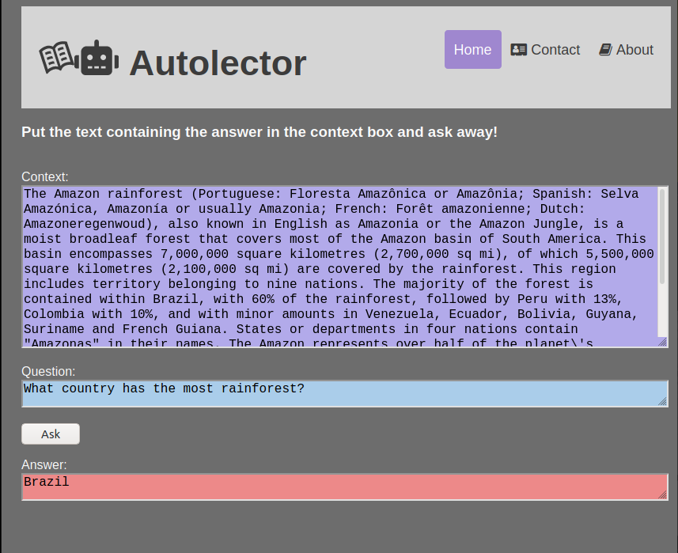

<script src="https://code.iconify.design/1/1.0.7/iconify.min.js"></script>
# <svg xmlns="http://www.w3.org/2000/svg" xmlns:xlink="http://www.w3.org/1999/xlink" aria-hidden="true" focusable="false" width="1em" height="1em" style="-ms-transform: rotate(360deg); -webkit-transform: rotate(360deg); transform: rotate(360deg);" preserveAspectRatio="xMidYMid meet" viewBox="0 0 20 20"><path d="M10.595 5.196l.446 1.371a4.135 4.135 0 0 1 1.441-.795c.59-.192 1.111-.3 1.582-.362l-.43-1.323a9.465 9.465 0 0 0-1.58.368a5.25 5.25 0 0 0-1.459.741zm.927 2.855l.446 1.371a4.135 4.135 0 0 1 1.441-.795c.59-.192 1.111-.3 1.582-.362l-.43-1.323a9.465 9.465 0 0 0-1.58.368a5.21 5.21 0 0 0-1.459.741zm.928 2.854l.446 1.371a4.135 4.135 0 0 1 1.441-.795c.59-.192 1.111-.3 1.582-.362l-.43-1.323a9.465 9.465 0 0 0-1.58.368a5.21 5.21 0 0 0-1.459.741zm-7.062 2.172l.43 1.323a8.745 8.745 0 0 1 1.492-.636a4.141 4.141 0 0 1 1.633-.203l-.446-1.371a5.25 5.25 0 0 0-1.615.257a9.406 9.406 0 0 0-1.494.63zM3.533 7.368l.43 1.323a8.825 8.825 0 0 1 1.492-.636a4.141 4.141 0 0 1 1.633-.203L6.643 6.48a5.263 5.263 0 0 0-1.616.258a9.406 9.406 0 0 0-1.494.63zm.927 2.855l.43 1.323a8.745 8.745 0 0 1 1.492-.636a4.141 4.141 0 0 1 1.633-.203L7.57 9.335a5.25 5.25 0 0 0-1.615.257a9.417 9.417 0 0 0-1.495.631zm6.604-8.813a5.26 5.26 0 0 0-3.053 2.559a5.257 5.257 0 0 0-3.973-.275C1.515 4.514.069 6.321.069 6.321l4.095 12.587c.126.387.646.477.878.143c.499-.719 1.46-1.658 3.257-2.242c1.718-.558 2.969.054 3.655.578c.272.208.662.06.762-.268c.252-.827.907-2.04 2.61-2.593c1.799-.585 3.129-.389 3.956-.1c.385.134.75-.242.625-.629L15.819 1.203s-2.232-.612-4.755.207zm-.113 13.846a5.208 5.208 0 0 0-3.141.044c-1.251.406-2.127.949-2.699 1.404L1.866 6.722c.358-.358 1.187-1.042 2.662-1.521c1.389-.451 2.528-.065 3.279.378l3.144 9.677zm6.894-2.689c-.731-.032-1.759.044-3.01.451a5.205 5.205 0 0 0-2.567 1.81L9.124 5.151c.346-.8 1.04-1.782 2.43-2.233c1.474-.479 2.547-.413 3.047-.334l3.244 9.983z" fill="#626262"/></svg><svg xmlns="http://www.w3.org/2000/svg" xmlns:xlink="http://www.w3.org/1999/xlink" aria-hidden="true" focusable="false" width="1.25em" height="1em" style="-ms-transform: rotate(360deg); -webkit-transform: rotate(360deg); transform: rotate(360deg);" preserveAspectRatio="xMidYMid meet" viewBox="0 0 640 512"><path d="M32 224h32v192H32a31.962 31.962 0 0 1-32-32V256a31.962 31.962 0 0 1 32-32zm512-48v272a64.063 64.063 0 0 1-64 64H160a64.063 64.063 0 0 1-64-64V176a79.974 79.974 0 0 1 80-80h112V32a32 32 0 0 1 64 0v64h112a79.974 79.974 0 0 1 80 80zm-280 80a40 40 0 1 0-40 40a39.997 39.997 0 0 0 40-40zm-8 128h-64v32h64zm96 0h-64v32h64zm104-128a40 40 0 1 0-40 40a39.997 39.997 0 0 0 40-40zm-8 128h-64v32h64zm192-128v128a31.962 31.962 0 0 1-32 32h-32V224h32a31.962 31.962 0 0 1 32 32z" fill="#626262"/></svg> Autolector

Hello all! This is a little example of using :hugs: [huggingface transformers](https://github.com/huggingface/transformers) and [Flask-RESTful](https://flask-restful.readthedocs.io/en/latest/index.html) to create a  question answering API.

### Install
The only real requirement is a Linux environment. If you are using Windows I recommend [installing Ubuntu for Windows](https://ubuntu.com/tutorials/ubuntu-on-windows). To install the needed software dependencies run:
```bash
cd /path/to/question_answering_api
bash install_dependencies.sh # This may take a while.
bash fetch_model.sh # So could this, depending on your connection speed.
```

### Usage
1. #### Start the API server  
    Open a terminal window and enter:
    ```bash
    cd /path/to/autolector
    python3 autolector_server.py
    ```
    and let it run while you're playing around with it. To kill the server press `Ctrl-C` while this terminal window is selected and it will close the process.  

2. #### Run the client.
    In a new terminal (_yes you need two open at the same time!_), run the commands:
    ```bash
    cd /path/to/autolector
    python3 autolector_client.py
    ```

    You should see something like this.
```
Context:
    The Amazon rainforest (Portuguese: Floresta Amazônica or
    Amazônia; Spanish: Selva Amazónica, Amazonía or usually
    Amazonia; French: Forêt amazonienne; Dutch:
    Amazoneregenwoud), also known in English as Amazonia or
    the Amazon Jungle, is a moist broadleaf forest that
    covers most of the Amazon basin of South America. This
    basin encompasses 7,000,000 square kilometres (2,700,000
    sq mi), of which 5,500,000 square kilometres (2,100,000
    sq mi) are covered by the rainforest. This region
    includes territory belonging to nine nations. The
    majority of the forest is contained within Brazil, with
    60% of the rainforest, followed by Peru with 13%,
    Colombia with 10%, and with minor amounts in Venezuela,
    Ecuador, Bolivia, Guyana, Suriname and French Guiana.
    States or departments in four nations contain "Amazonas"
    in their names. The Amazon represents over half of the
    "planets remaining rainforests, and comprises the "
    largest and most biodiverse tract of tropical rainforest
    in the world, with an estimated 390 billion individual
    trees divided into 16,000 species.
Question:
  Which name is also used to describe the Amazon rainforest in English?
Answer:
  Amazonia.
```  

### Docker

To run the API inside a container you need to take the following steps:
1. #### Install docker
  Follow the instructions [here](https://docs.docker.com/engine/install/) to install docker on your system.  

2. #### Download models  
  To download the models from hugging face open a terminal, navigate to the repository, and run
  ```bash
  bash fetch_model.sh
  ```

3. #### Build the container
  Open a terminal and run:
  ```bash
  cd /path/to/autolector # Optional if you're in repo root already.
  # Build container and name image qa-api with version tag v1.
  docker build -t autolector:v1 . # <-- DON'T FORGET THIS PERIOD!!!
  ```

4. #### Start the container
  In the same terminal, type in:
  ```bash
  docker run \
    -p 5000:5000 \ # binds port host:container
    -v /path/to/autolector/models:/app/models \ # Mounts host:container
    autolector:v1
  ```  

5. #### Run the client
  In a new terminal window (just like before, we need two open), run the following:
  ```bash
  # Make sure you're in repo root!
  python3 autolector_client.py
  ```  

And that's it! If you want to [host your API in the cloud](https://geekflare.com/docker-hosting-platforms/) now it's almost as easy as saying `docker push`.

### Web page
Alternately, you can open up a browser navigate to `./index.html` or open a terminal and enter:
```bash
# Of course...
cd /path/to/autolector

# If you've installed locally.
python3 autolector_server.py & # This will run process in the background

##########
##  OR  ##
##########

# If you've installed with docker.
docker run \
  -p 5000:5000 \ # binds port host:container
  -v /path/to/autolector/models:/app/models \ # Mounts host:container
  autolector:v1 & # Not sure if this is necessary, but whatever.

# You've got to change /path/to -> <the actual path>
firefox file:///path/to/autolector/index.html
```
after getting the API running locally as show above. I recommend this way, as it shows the real value of putting a service behind an API rather than creating a question answering agent on the command line. It should look something like this.


### Conclusion  
So now you've got a good idea of how to design a website from front to back. You can host your static code on github, put your Flask APIs somewhere in the cloud (that's what docker is good for), and you're in business. Good luck!
